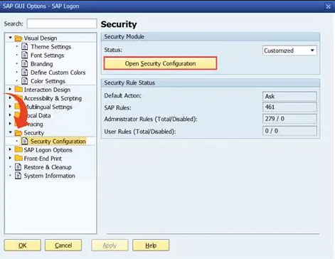
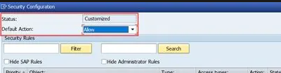
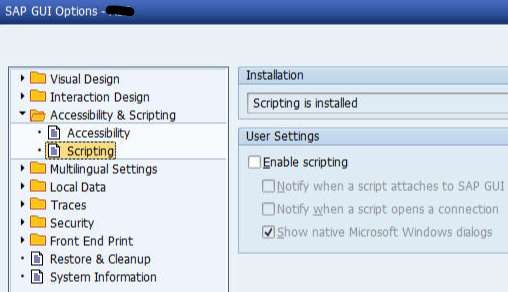

## How to configure your SAP GUI settings to handle scripting.

1) Open SAP (S4HANA or ECC).
   - On the main home screen, click the "Customize Local Layout" button.
   - Click on "Options" from the drop down menu.

      

3) Go to "Security Configuration" under the security folder.
   - Click on "Open Security Configuration".

      

5) Make sure the default drop down menu selection is set to "allow".
   - This turns off the notification popup window in your GUI sessions that asks if you want to allow things like:
     - Are you sure you want to export to Excel?
   - After you change these settings make sure you press apply and save.

      

6) Now open Accessibility & Scripting folder.
   - Check "enable scripting".
   - Uncheck the other 3 notify boxes.
     - This disables the popup messages telling you the scripting engine is running.
     - The picture below is showing the third box checked, do not do this.
   - After you change these settings, make sure you press apply and save.
  
      
