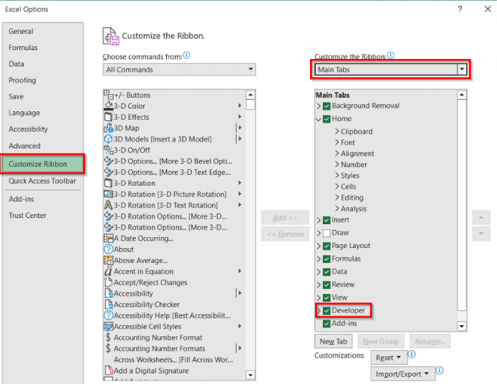
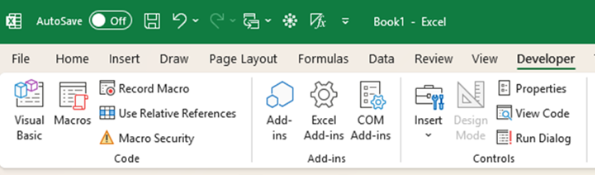
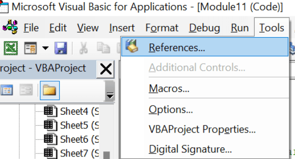
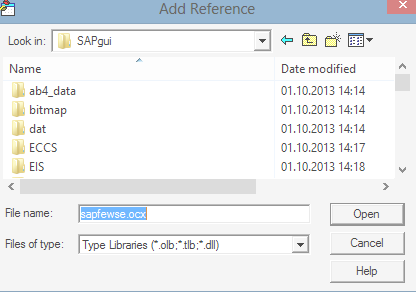
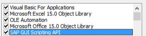
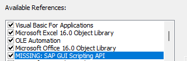

## Main Purpose

For when company policy does not allow automation/analytics tools such as Python, and only for scripting is standard MS365 and Windows applications.

## Configuring VBA to handle SAP Scripting

1.) Open Excel and go to file -> options -> customize ribbon -> add developer tab

2). Open developer tab, then open Visual Basic

3). Go to Tools -> references -> browse

4.) The file you're looking for is called "sapfewse.ocx"
  - It's usually in C:\Program Files\SAP\FrontEnd\SAPGUI
  - Once in the folder where it should be. Change file type searching for to "ActiveXControls(*.ocx)".
  - Then find and open "sapfewse.ocx"

5.) After opening the file, and back in the reference library selection list. Find "SAP GUI Scripting API". Make sure it's checked. Hit ok when done.

6.) Save this workbook and label it so you'll remember this is your SAP scripting enabled workbook.

## Some Notes

- All of this is not needed if VBA is not being used for processing data entry into SAP.
  - This is not needed for Python or other language based scripting.
  - This is more for enhancing a MS Office based dashboard set up, that allows SAP controls and interactions for the user.
- This configuration is done per file and/or single session EXE like an active open Outlook session.
  - Outlook can be configured once and will only need to be reconfigured if you reset your settings or sometimes when you create multiple Outlook sessions it bugs out and makes you reconfigure everything again.
  - Excel, Access, Word, etc. all need to be configured per file.
  - When sending/sharing files the new user does not need to reconfigure settings as it's per file.
    - The new user will need to open up the reference library selection list and uncheck the "MISSING" libraries you may have been using that they don't need.
    - Sometimes if their sapfewse.ocx file is in a different location they need to have everything reconfigured.

